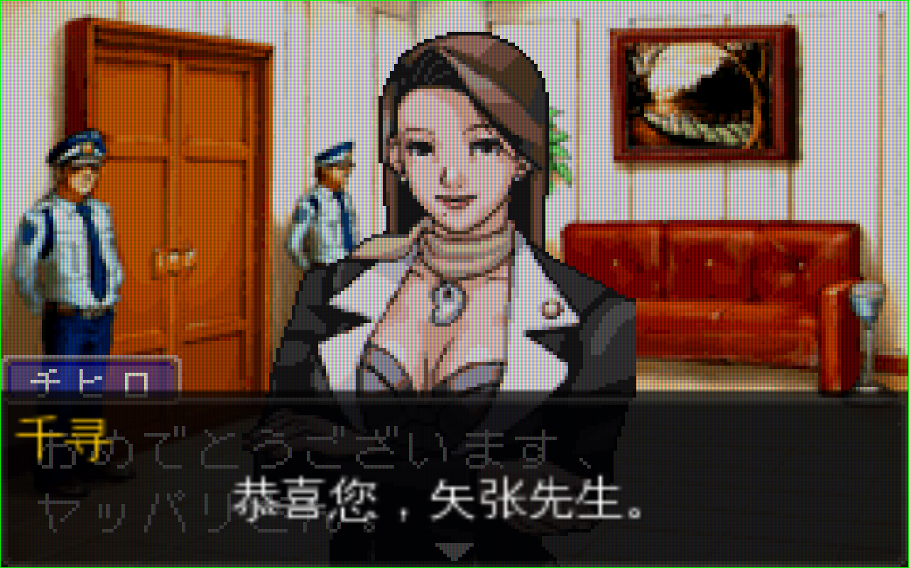
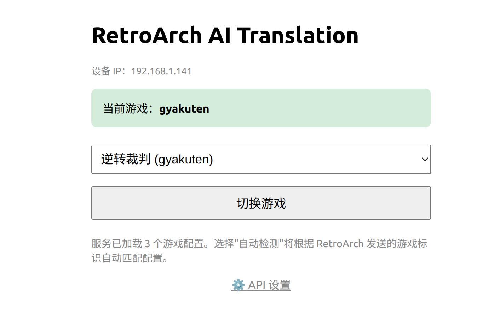
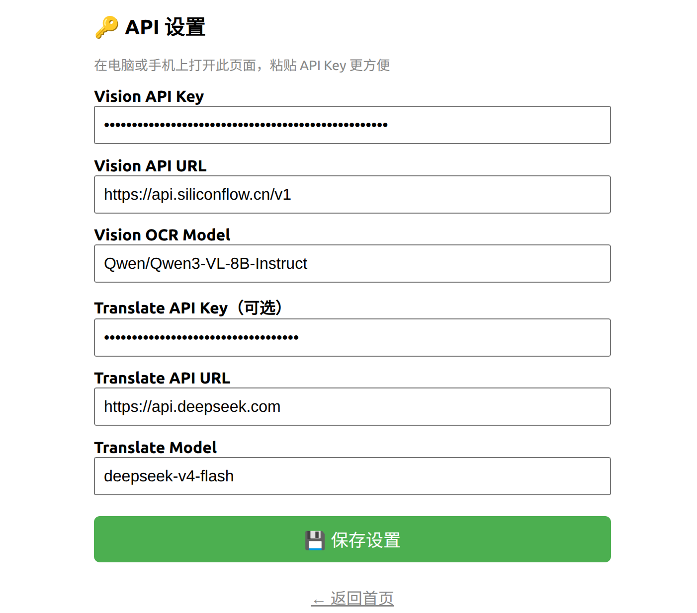
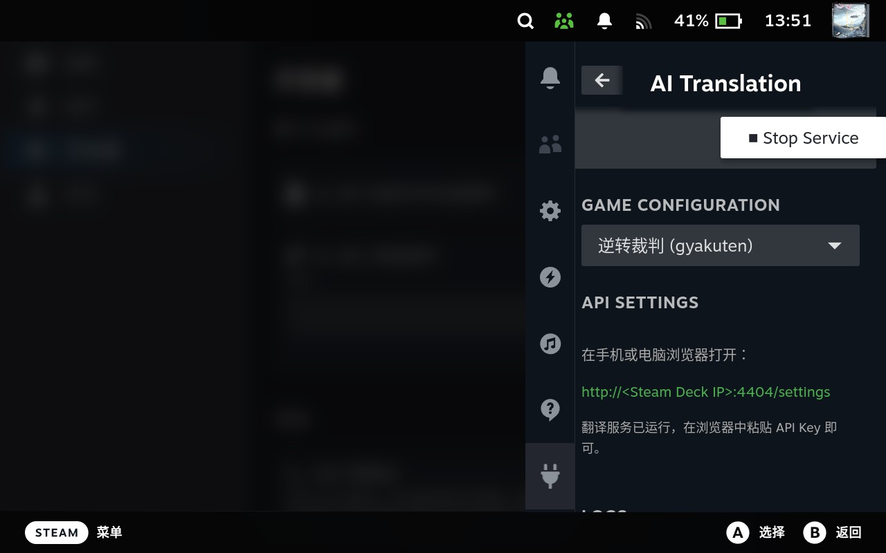

# RetroArch AI Translate

基于 Vision LLM 的实时游戏截图翻译服务，通过 RetroArch AI Service 协议在画面叠加层显示翻译结果。

## 快速开始

### 环境要求

- Python 3.10+ 或 Docker
- [SiliconFlow](https://siliconflow.cn) API Key（或其他兼容 OpenAI 接口的 Vision API）
- RetroArch 模拟器

### 方式一：Docker Compose

```bash
# 1. 配置 API Key
cp .env.example .env
# 编辑 .env，至少填入 VISION_API_KEY

# 2. 启动服务
docker compose up -d
```

服务启动后监听 `http://0.0.0.0:4404`。

### 方式二：直接运行

```bash
# 1. 安装依赖
pip install -r requirements.txt

# 2. 设置环境变量
export VISION_API_KEY=sk-your-key-here
# 可选：使用付费翻译模型
export TRANSLATE_API_KEY=sk-your-translate-key
export TRANSLATE_BASE_URL=https://api.deepseek.com
export TRANSLATE_MODEL=deepseek-v4-flash

# 3. 启动
python -m src.retroarch_translate
```

### RetroArch 设置

1. **设置 → AI 服务 → AI 服务开关** = 开启
2. **设置 → AI 服务 → AI 服务模式** = **Image (mode 0)**（必须选此项才能显示叠加层）
3. **设置 → AI 服务 → AI 服务网址** = `http://127.0.0.1:4404`
   - Steam Deck 上可在 `/etc/hosts` 添加 `127.0.0.1 translate.lan`，然后填写 `http://translate.lan:4404`（注意：不可用 `.local` 后缀，会被 mDNS 拦截）
4. **设置 → AI 服务 → 翻译时暂停** = 开启
5. **设置 → 输入 → 快捷键 → AI 服务** — 绑定一个按键

加载游戏后按下快捷键即可翻译。

## 效果预览



## Web 管理界面

服务启动后，浏览器打开 `http://localhost:4404/` 即可访问管理界面，无需额外配置。

### 游戏切换

在首页下拉菜单中选择游戏配置，语言模型会立即应用对应的术语表、角色语气和名台词。支持多设备独立选择（通过 IP 区分），也可以选择「自动检测」由 RetroArch 的 `label` 字段自动匹配。



### API 密钥配置

点击首页底部的「⚙️ API 设置」进入密钥管理页面。支持配置：

- **Vision API**：OCR 模型、API 地址、密钥
- **Translate API**：翻译模型、API 地址、密钥（可选，不填则使用免费模型）

保存后无需重启服务，立即生效。

### 服务日志

同一页面下方提供实时日志查看器，支持：
- **增量刷新**：页面加载后每 2 秒自动拉取新日志
- **暂停/继续**：方便查看已滚动过的内容
- **关键字筛选**：实时过滤，只显示匹配行
- **自动滚动**：默认跟随底部，向上滚动后暂停
- **复制/下载**：一键复制全部日志，或下载为 `.log` 文件
- **容量**：保留最近 1000 行，溢出自动淘汰

日志可能包含游戏文字和客户端 IP 地址，请不要在公共场合分享。退出服务后日志会保留在内存中，仅在进程退出时释放。



## Steam Deck 插件

项目提供 Decky Loader 插件，可在 Steam Deck 的快速访问菜单（QAM）中直接管理翻译服务。



### 功能

- **启动 / 停止服务**：一键开关翻译 HTTP 服务，查看运行状态和当前模型
- **切换游戏配置**：下拉菜单选择已加载的游戏，自动应用术语表和角色语气
- **配置 API 密钥**：在 QAM 中直接填写 Vision / Translate API 密钥，保存即生效
- **实时日志**：查看翻译流水线的最新日志，方便排查问题
- **开机自启**：插件加载时自动启动服务（可在设置中关闭）

### 安装

1. 确保 Steam Deck 已安装 [Decky Loader](https://decky.xyz)
2. 下载 `retroarch-ai-translate.zip`
3. Decky → 设置 → 开发者 → 从 ZIP 安装插件
4. 重启插件加载器：`sudo systemctl restart plugin_loader`

### 开发

```bash
cd decky-plugin
pnpm install
pnpm run build      # 构建前端
pnpm run package    # 打包为 .zip 分发
```

## 环境变量

| 变量 | 默认值 | 说明 |
|---|---|---|
| `VISION_API_KEY` | *(必填)* | Vision OCR API 密钥 |
| `VISION_BASE_URL` | `https://api.siliconflow.cn/v1` | Vision API 地址 |
| `VISION_OCR_MODEL` | `PaddlePaddle/PaddleOCR-VL-1.5` | OCR 视觉模型 |
| `TRANSLATE_API_KEY` | *(可选)* | 付费翻译 API 密钥，不填则使用免费模型 |
| `TRANSLATE_BASE_URL` | *(自动)* | 翻译 API 地址 |
| `TRANSLATE_MODEL` | `deepseek-ai/DeepSeek-V4-Flash` | 付费翻译模型 |
| `TRANSLATE_MT_FREE_MODEL` | `tencent/Hunyuan-MT-7B` | 免费翻译模型 |
| `LISTEN_HOST` | `127.0.0.1` | 服务监听地址 |
| `LISTEN_PORT` | `4404` | 服务监听端口 |
| `REQUEST_TIMEOUT` | `45` | API 请求超时（秒） |
| `GAME_CONFIG_DIR` | `./games` | 游戏配置文件目录 |
| `TRANSLATION_CACHE_SIZE` | `128` | LRU 缓存上限 |
| `HOST_BIND` | `0.0.0.0` | Docker 宿主机绑定地址 |
| `HOST_PORT` | `4404` | Docker 宿主机端口 |

## 游戏配置

每个游戏可以通过 YAML 配置文件定制 OCR 和翻译行为，支持界面识别提示、术语表、角色语气、标志性台词和场景模式。配置文件放在 `./games/<game_id>.yaml`（项目根目录下的 games 文件夹），也可以直接写入 [templates/game_config.yaml](templates/game_config.yaml)。

内置三个游戏配置示例：**逆转裁判**（`gyakuten`）、**火焰纹章**（`fire_emblem`）、**塞尔达传说 缩小帽**（`zelda_minish`）。

### 配置示例：逆转裁判

```yaml
game_id: gyakuten
display_name: 逆转裁判
language: jpn

# 可选 OCR 上下文：仅用于帮助视觉模型定位和辨认文字
ocr:
  ui_style: "GBA 法庭文字冒险界面，人物立绘位于画面中央或两侧。"
  dialogue_style: "深色对话框配白色像素日文，角色名与正文分开显示。"
  dialogue_location: "主要对话通常位于画面下方约三分之一。"
  characters: "成歩堂龍一、綾里真宵、御劍怜侍、裁判長"
  ignore_regions: "忽略纯装饰背景和无文字的人物立绘。"

signature_phrases:
  異議あり！: 反对！
  待った！: 等等！
  くらえ！: 接招！

character_tones:
  成歩堂: "口语化，语气词多（吧、啊、呢），偶尔吐槽"
  御劍: "冷静克制，句式完整，用词正式"

scene_modes:
  courtroom: "法庭辩论场景。保持紧迫感，句子短而有力。"
  investigation: "调查取证场景。语气平和，描述性文字完整翻译。"

glossary:
  法廷: 法庭
  検察官: 检察官
  証拠: 证据
  # ... 更多术语
```

`ocr` 中的 `ui_style`、`dialogue_style`、`dialogue_location`、`characters` 和 `ignore_regions` 均为可选的单行字符串。为兼容 Decky 内置的精简 YAML 解析器，请勿在该段使用列表、块字符串或更深层嵌套；多个角色可用逗号或顿号分隔。提示只影响 Vision OCR 的定位和辨字，不会裁剪截图，也不能保证模型完全避免误识别。旧配置无需迁移；没有有效 `ocr` 段时仍使用原有固定提示。

翻译缓存会同时考虑截图和完整游戏配置，因此修改 OCR 提示、术语表或角色语气后不会复用旧译文。

### 运行时切换配置

- **Web 界面**：浏览器打开 `http://localhost:4404/`
- **API**：`POST /set-game`，body 为 `{"game_id": "gyakuten"}`
- **URL 参数**：`http://localhost:4404/?game=gyakuten`

## 项目结构

```
├── src/
│   ├── retroarch_translate.py   # 入口，启动 HTTP 服务
│   ├── http_server.py           # HTTP 请求处理 + Web 管理界面
│   ├── ocr.py                   # Vision LLM OCR 客户端
│   ├── translate.py             # 机器翻译客户端
│   ├── overlay.py               # 基于 Pillow 的文字叠加层渲染
│   ├── cache.py                 # LRU 截图翻译缓存
│   ├── config.py                # 环境变量常量
│   ├── game_config.py           # YAML 配置加载与解析
│   └── server_manager.py        # HTTP 服务生命周期管理（日志缓冲）
├── decky-plugin/                # Steam Deck Decky Loader 插件
│   ├── main.py                  # 插件后端（RPC 接口、服务管理）
│   ├── src/                     # React TypeScript 前端组件
│   ├── py_modules/              # vendored Python 依赖
│   └── package.sh               # 打包脚本
├── templates/
│   └── game_config.yaml         # 预置游戏配置
├── references/
│   └── protocol-spec.md         # RetroArch AI Service 协议规范
├── games/                       # 运行时游戏状态 + 自定义配置
├── docker-compose.yml
├── Dockerfile
├── requirements.txt
└── .env.example
```

## 费用

翻译成本极低。以 DeepSeek V4 Flash 为例：

| 场景 | 费用 |
|---|---|
| 单次翻译（约 50 输入 + 30 输出 token） | ¥0.00011 |
| 一小时游戏（约 200 次快捷键） | ¥0.02 |
| 逆转裁判通关（约 30 小时） | ¥0.60 |

使用免费模型（SiliconFlow 上的 Hunyuan-MT-7B）则完全免费。

## 部署场景

- **本机**（推荐）：Python 服务与 RetroArch 在同一台机器，绑定 `127.0.0.1:4404`。
- **家庭服务器 / NAS**：Docker 运行，RetroArch 通过局域网 IP 访问。
- **复古掌机**（RG35XX、Miyoo 等）：在局域网其他设备上运行服务，RetroArch 配置远程 URL。Android 设备可通过 `adb forward tcp:4404 tcp:4404` 转发。
- **Steam Deck**：安装 Decky Loader 插件，在 QAM 中管理服务。RetroArch URL 可填写 `http://127.0.0.1:4404`，或添加 hosts 映射后使用 `http://translate.lan:4404`。

## 注意事项

- 服务始终返回 HTTP 200，错误信息放在 JSON 的 `"error"` 字段中（遵循 RetroArch 协议规范）。
- RetroArch 中 **翻译时暂停** 必须开启，否则截图可能捕获动画中间帧。
- 翻译缓存通过对截图裁剪上下边缘并降采样后取哈希，并加入当前完整游戏配置的指纹；闪烁的光标和状态栏不会导致缓存未命中，切换或修改配置也不会复用旧译文。

## 参考资料

- [RetroArch AI Service 文档](https://docs.libretro.com/guides/ai-service/)
- [RetroSprite](https://github.com/MightyKartz/RetroSprite) — Android 平台翻译工具
- [VGTranslate Local](https://github.com/objaction/vgtranslate_local) — 基于 PaddleOCR 的方案
